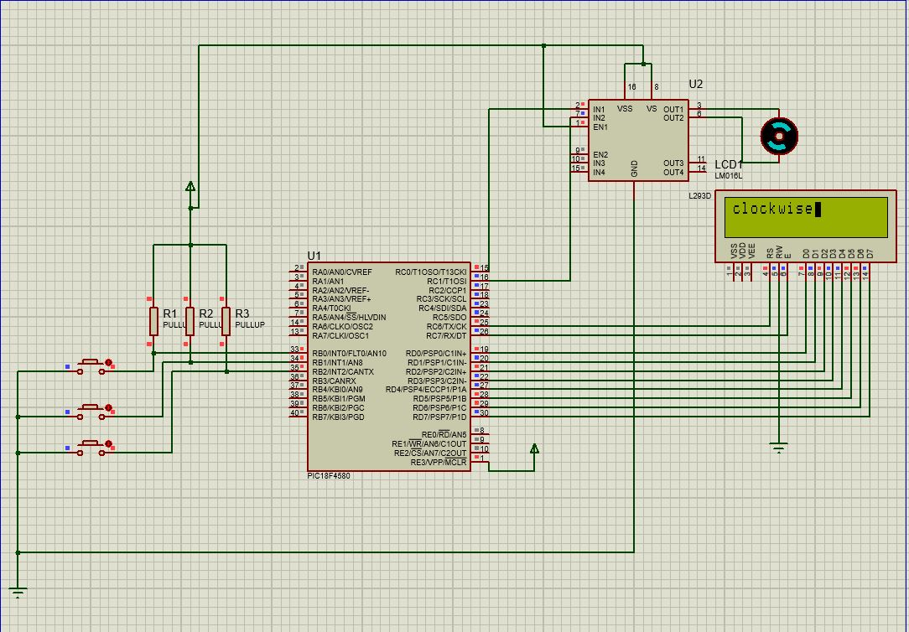

# PIC18F4580 Motor Control with LCD

This project demonstrates motor control using the **PIC18F4580 microcontroller** and **L293D motor driver**, with real-time feedback displayed on an **LCD (16x2)**.  
The project was written in **Embedded C** (MPLAB) and simulated in **Proteus 8**.

---

## 🎯 Features
- **Button RB0** → Rotate motor clockwise (LCD shows "clockwise")  
- **Button RB1** → Rotate motor anti-clockwise (LCD shows "Anti-clockwise")  
- **Button RB2** → Stop the motor (LCD shows "stop")  

---

## 🛠️ Tools & Software
- **IDE**: MPLAB (XC8 compiler)  
- **Simulator**: Proteus 8 Professional  

---

## 📂 Files in This Project
- `motor_control.c` → Source code  
- `motor_control.pdsprj` → Proteus project file  
- `proteus-schematic.JPG` → Circuit schematic (exported from Proteus)  

---

## 🔌 Circuit Diagram

---

